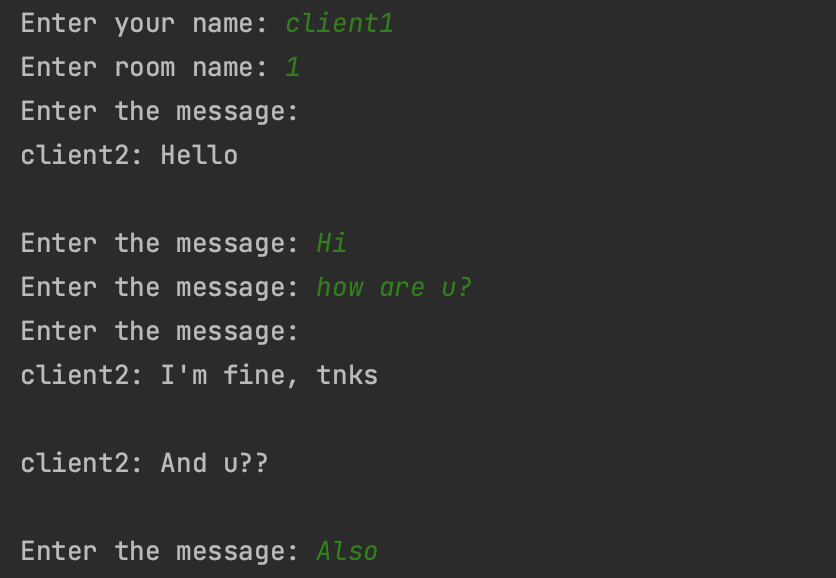
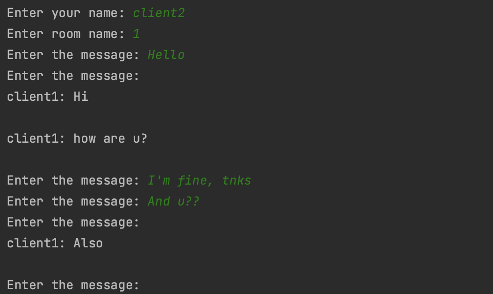
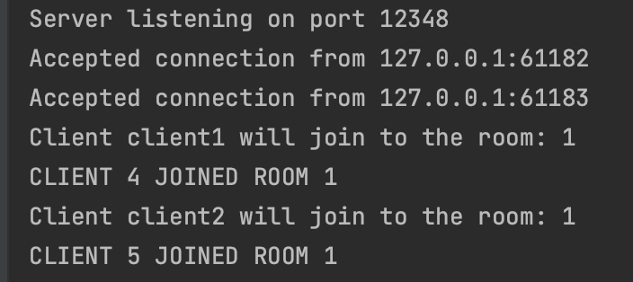
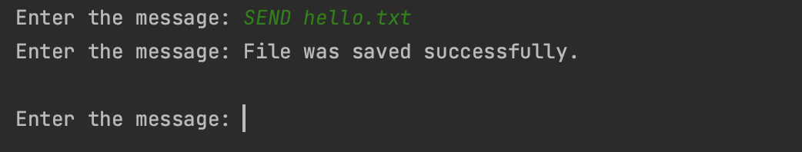
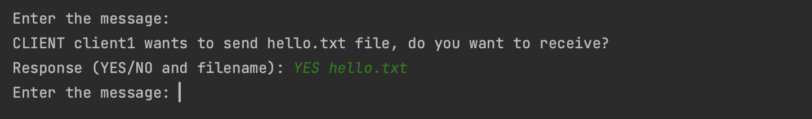
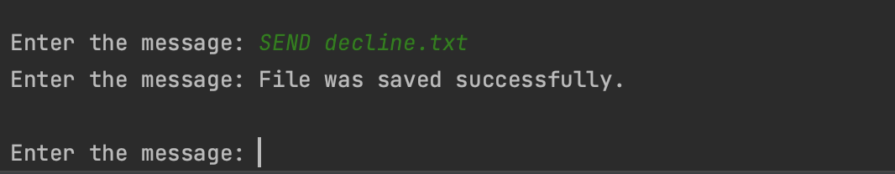
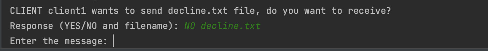
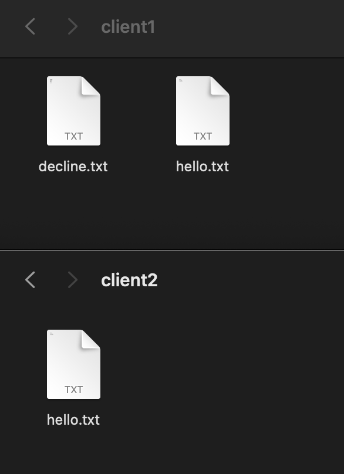

# Client-Server Chat App

## General System Description
This application is a multi-threaded chat system that allows users to communicate across different chat rooms using TCP connections.\
It supports features such as message sharing, file sharing, and room management (join, exit, and change rooms). The server can handle multiple clients concurrently.

Port: 12348\
IP Address: localhost (127.0.0.1)\
Input: Any message less than 1024 bytes, also commands (SEND anf EXIT). Each element (letter, sign, figure) in input is a char.\
Data Transfer Method: Binary\
Buffers and Chunks: no more than 1024 bytes\
Char: 1 byte (since the code is written in C++)\

## Application Protocol Description
Protocol Type: TCP (Transmission Control Protocol)\
Data Transfer Method: Binary\
Connection Establishment: Clients initiate TCP connections, which the server accepts, creating a new thread for each client.\
Choosing Room: Clients enter name and roomName, which the server handles, creating a new room or added in the existing.\
Command Exchange: Clients send message to another client or commands (SEND, EXIT) to the server, which processes accordingly.\
File Sharing: Client can share a file, and all other clients in the room can accept or decline receiving. For each client in the server side exist a special folders for storing sharing data with other users.\
Mutexes: Uses to ensure that when one thread is using a shared resource (<cout> in the application), other threads
are prevented from accessing the same resource at the same time. This avoids data corruption.\
Threads: Each client connection and room is handled in a separate thread, allowing for concurrent processing of client requests and different rooms.\
Rooms Usage: Each chat room is managed by the Room class, supporting real-time communication among clients. 
It includes a unique name, a thread for broadcasting messages, a list of client sockets, a message queue for pending messages, and synchronization mechanisms (std::mutex and std::condition_variable) to ensure thread safety.\

## Screenshots of Different Use Cases
### Join Room and Send Messages:
\
\
\

###  Send File, Accept File, Decline File:
\
\
\
\
\
\

## Explanation of Different Use Cases Using UML Diagram

